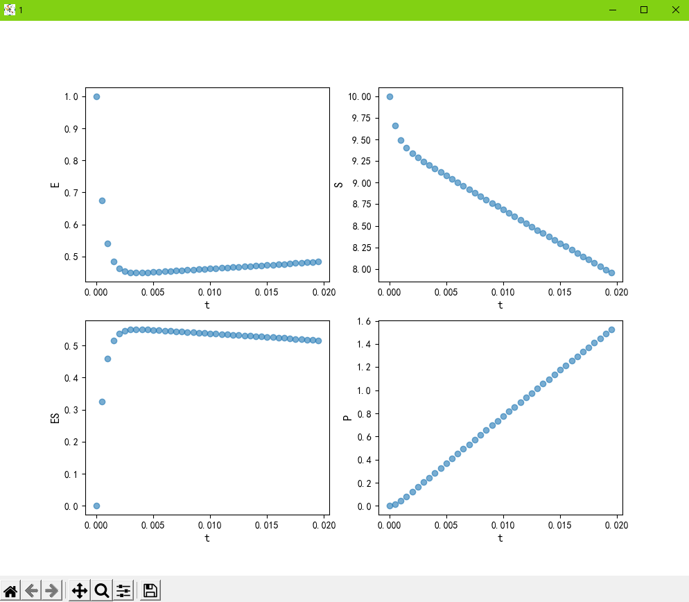
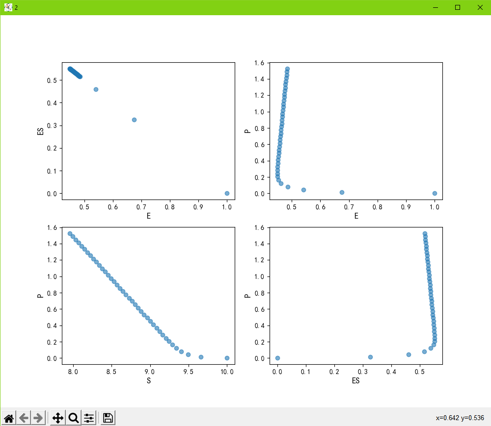
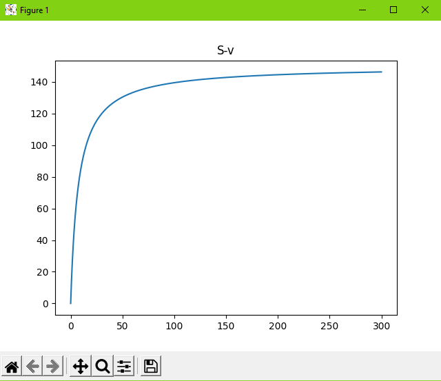

# Question 2

### 8.1
```
  1. dS / dt  = - k1 * E * S + k2 * ES
  2. dES / dt =   k1 * E * S - (k2 + k3) * ES
  3. dE / dt  = - k1 * E * S + (k2 + k3) * ES
  4. dp / dt  =   k3 * ES
```
### 8.2

Please refer to my code in 8.2.py.
The result pictures are as follow:
<p align="center">
  
</p>
<p align="center">
  
</p>


### 8.3

Please refer to my code in 8.3.py. The result pictures are as follow:

<p align="center">
  
</p>
Accoring to the picture, the Vm is about 145 uM.


